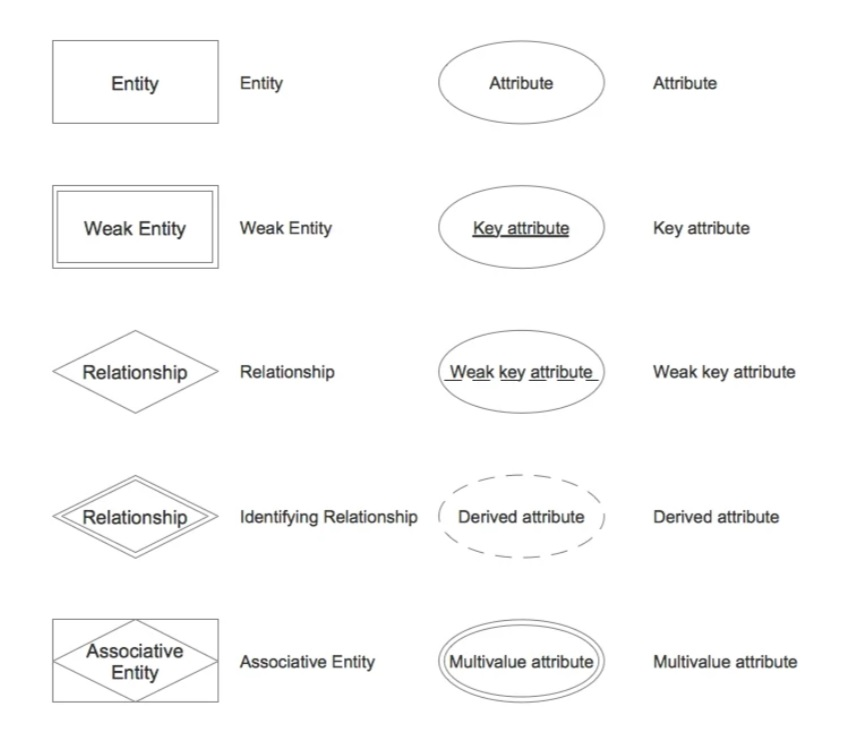
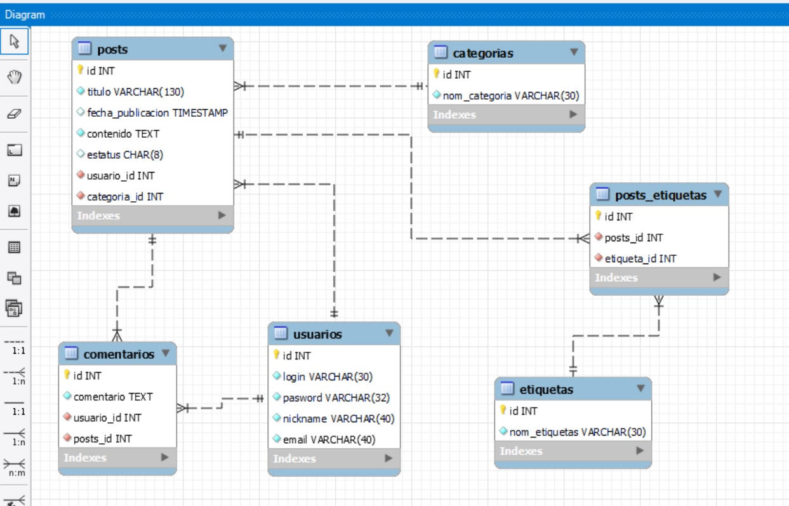
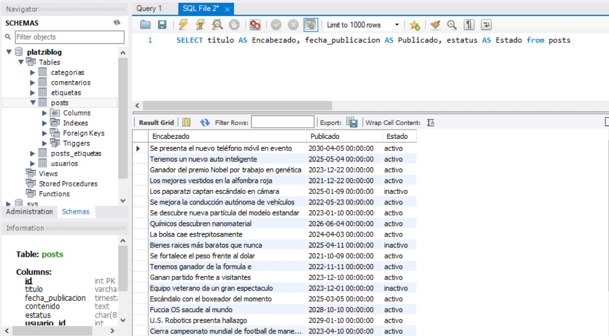
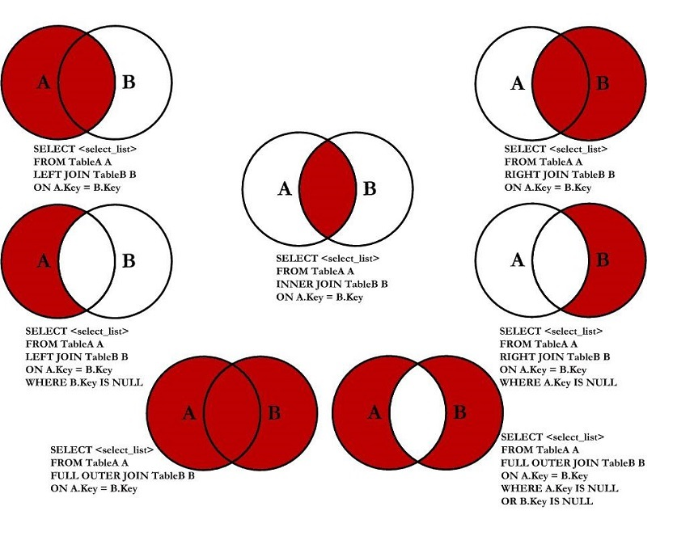
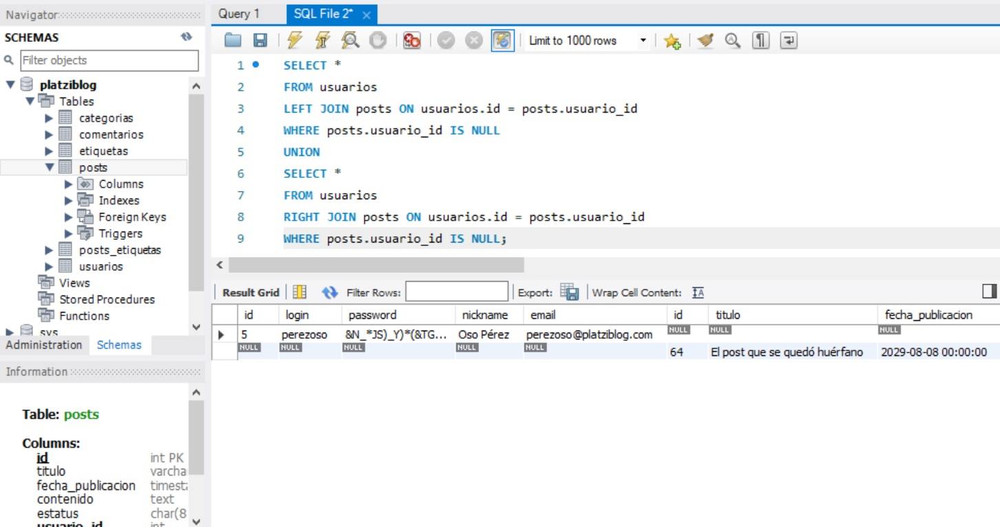
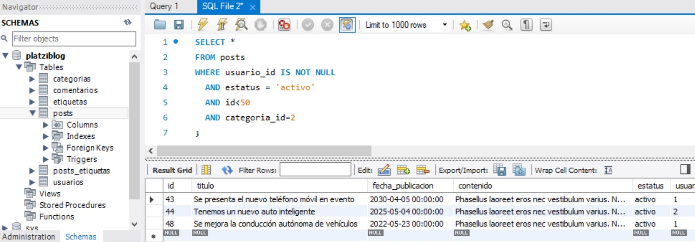

# Database Fundamentals Course

### Table of contents
* [Introduction](#introduction) 
* [Technologies](#technologies)
* [Commands](#commands)
* [Syntax](#syntax)
* [Illustrations](#illustrations)


## Introduction
In this course we learn about database fundamentals, including relational and non relational databases, tables and the different kind of RDBMS (Relational Database Management System)

---------------------------------------------------------------

## Technologies
* MySQL 5.6
---------------------------------------------------------------


## Commands

##### Constraints
| Constraints | Description                    |
| ------------- | ------------------------------ |
| `NOT NULL Constraint`      | Ensures that a column cannot have NULL value.       |
| `DEFAULT Constraint`   |  Provides a default value for a column when none is specified. | 
| `UNIQUE Constraint`   | Ensures that all values in a column are different.    | 
| `PRIMARY Key`   |  Uniquely identifies each row/record in a database table.     | 
| `FOREIGN Key`   |  Uniquely identifies a row/record in any of the given database table.     | 
| `CHECK Constraint`   |  The CHECK constraint ensures that all the values in a column satisfies certain conditions.    | 
| `INDEX`   |  Used to create and retrieve data from the database very quickly.     | 

************************************************************************************************
##### DML  (Data Manipulation Language)
| Function name | Description                    |
| ------------- | ------------------------------ |
| `SELECT`      | Retrieve data from the database.       |
| `INSERT`   |  Insert data into a table. | 
| `UPDATE`   | Update existing data within a table.    | 
| `DELETE`   |  Delete records from a database table.     | 
************************************************************************************************

## Syntax

#### DDL / Data Definition Language

##### The ‘CREATE TABLE AS’ Statement

Syntax

```
  CREATE TABLE NewTableName AS
		SELECT Column1, column2,..., ColumnN
		FROM ExistingTableName
		WHERE ....;
```    


Example

```  
		CREATE TABLE ExampleTable AS
		SELECT EmployeeName, PhoneNumber
		FROM Employee_Info;
```
---------------------------------------------------------------
##### The ‘DROP DATABASE’ Statement

Syntax

```
		DROP DATABASE DatabaseName;
```

Example

```
    DROP DATABASE Employee;
```
---------------------------------------------------------------
##### The ‘ALTER TABLE’ Statement

Syntax

```
		ALTER TABLE TableName
		ADD ColumnName Datatype;

		ALTER TABLE TableName
		DROP COLUMN ColumnName;
```   

Example

```
		ALTER TABLE Employee_Info
		ADD BloodGroup varchar(255);
  ```
 		
---------------------------------------------------------------
##### The USE statement

Syntax
  ```
		USE DatabaseName;
  ```
---------------------------------------------------------------
##### The ‘CREATE VIEW’ statement

Syntax
  ```
		CREATE VIEW ViewName AS
		SELECT Column1, Column2, ..., ColumnN
		FROM TableName
		WHERE Condition;
```


Example
```
		CREATE VIEW [Monterrey Employees] AS
		SELECT EmployeeName, PhoneNumber
		FROM Employee_Info
		WHERE City = "Monterrey";
```

**************************************************

#### DML  Data Manipulation Language


##### INSERT

```
Insert into <table_name> (column list) values (column values);
```


Example

```
Insert into Employee(Emp_id, Emp_name) values (001, “ bhanu”);
Insert into Employee(Emp_id, Emp_name) values (002, “ hari”);
Insert into Employee(Emp_id, Emp_name) values (003, “ bob”);
```


---------------------------------------------------------------
##### SELECT


Syntax
```
SELECT * from <table_name>;
For example, if we want to select all rows from the Employee database, we can use the following command −
```
Example
```
SELECT * from Employee;
```
---------------------------------------------------------------
##### DELETE

Syntax
```
 Delete from <table_name>WHERE condition;
 ```
Example
```
DELETE from Employee WHERE Emp_id=002;
```
---------------------------------------------------------------
##### UPDATE

Syntax
```
UPDATE <table_name> SET column_number =value_number WHERE condition;
```
Example
```
UPDATE Employee SET Emp_name= Ram WHERE Emp_id= 001;
```


---------------------------------------------------------------

## Illustrations

##### Entities and Attributes graphic representation

**************************************
##### The Reverse Engineering tool, shows a diagram with the relationship between tables of the project
(This is the diagram of our practice)

**************************************
##### Practice with SELECT statement

**************************************
##### SQL JOINS

**************************************
##### OUTER JOIN - Symmetric difference Practice

**************************************
##### NOT NULL practice

**************************************

